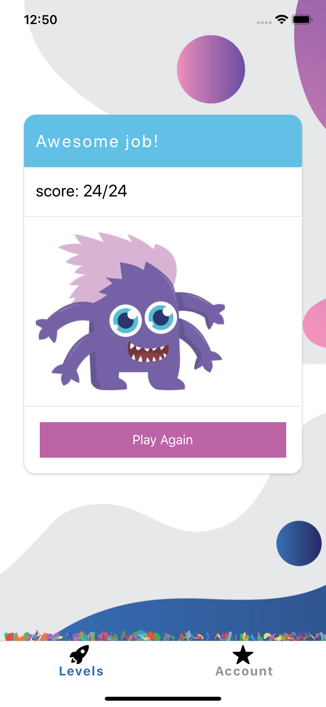

# Math Time
Mobile app for kids to practice No Hesitation Math, grades K-5    

* Players have 60 seconds to solve 24-30 problems.
* Players can select a level and are given problems to solve based on their grade. 
* Awarded Best App for Educators and Teachers

[Published version](https://exp.host/@alenai/MathTime)

